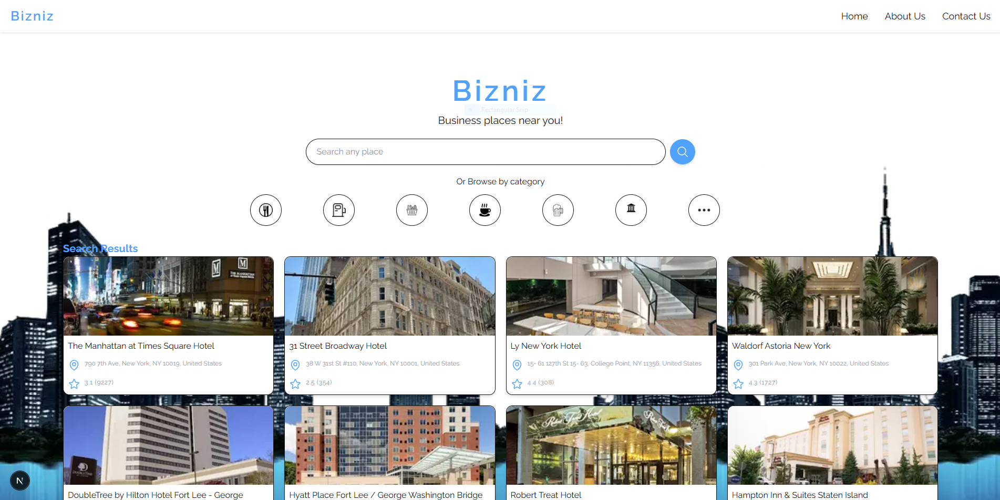
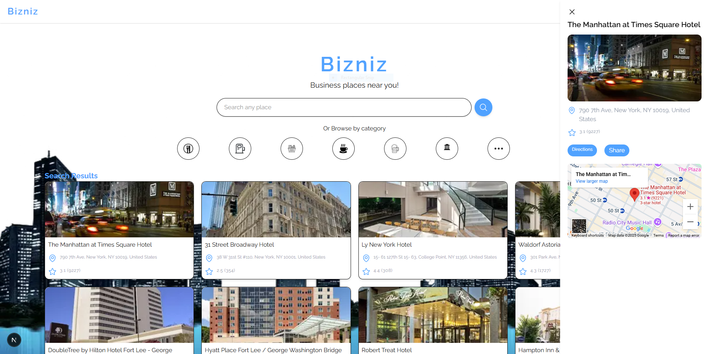

## <a name="bizniz">Bizniz</a>

<div>
  <h3 align="center">Bizniz</h3>
</div>

## <a name="deployedlink">Deployed App Link</a>

**Deployed App:** https://myportfolio-louis-vincellis-projects.vercel.app/

## <a name="table">Table of Contents</a>

1. [Introduction](#introduction)
2. [Tech Stack](#tech-stack)
3. [Features](#features)
4. [Screenshots](#screenshots)
5. [Cloning](#cloning)
6. [Deploy](#deploy)

## <a name="introduction"> Introduction</a>

Bizniz is a location-based web application built with **Next.js** and **Typescript** that helps users discover businesses around them or anywhere in the world. Whether you're looking for nearby hotels, cafés, gas stations, or other businesses, Bizniz makes it quick and easy using the **Google Maps API**.

## <a name="features"> Features</a>

 **Search by Business Type**: Find specific categories like cafés, hotels, gas stations, and more.

 **Auto-Detect Location**: Uses geolocation to show businesses near your current position.

 **Global Search**: Search for businesses in any city or region across the globe.

 **Interactive Google Map**: Visually explore results on a real-time, interactive map.

 ## <a name="tech-stack"> Tech Stack</a>

- Next.js
- TypeScript
- Google Maps Places API
- Browser Geolocation API
- Tailwind CSS
- Turbopack

## <a name="screenshots"> Screenshots</a>





## <a name="cloning"> Cloning</a>

**Prerequisites**

Make sure you have the following installed on your machine:

- [Git](https://git-scm.com/)
- [Node.js](https://nodejs.org/en)
- [npm](https://www.npmjs.com/) (Node Package Manager)

**Cloning the Repository**

```bash
git clone https://github.com/louisvincelli/bizniz.git
cd bizniz
```

**Installation**

Install the project dependencies using npm:

```bash
npm install
```

**Set Up Environment Variables**

You'll need a Google Maps API key(with Places and Maps Javascript APIs enabled). Create a file named `.env.local`:

```env
NEXT_PUBLIC_GOOGLE_MAPS_API_KEY=your_api_key_here

```

Replace the placeholder values with your credentials. You can obtain these credentials by signing up on the [Google Cloud Console](https://cloud.google.com/).

**Running the Project**

```bash
npm run dev
```

Open [http://localhost:3000](http://localhost:3000) in your browser to view the project.

## <a name="deploy"> Deploy on Vercel</a>

The easiest way to deploy your Next.js app is to use the [Vercel Platform](https://vercel.com/new?utm_medium=default-template&filter=next.js&utm_source=create-next-app&utm_campaign=create-next-app-readme) from the creators of Next.js.

[Next.js deployment documentation](https://nextjs.org/docs/app/building-your-application/deploying)


